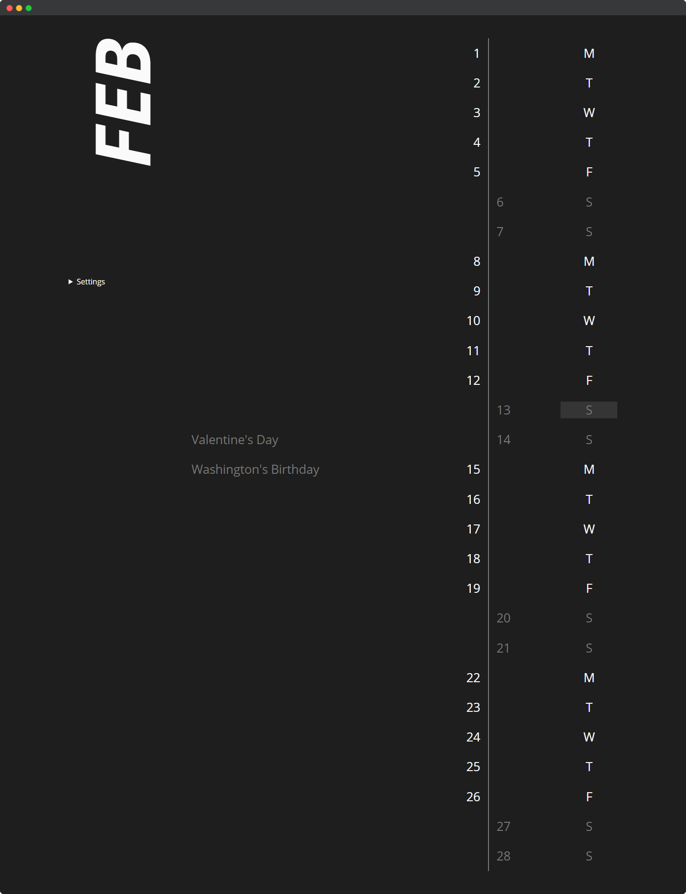

# vertical-calendar



CSS/Vue3 exercise duplicating some calendar ad I found on Insta.

## Project setup

```bash
npm install
```

### Compiles and hot-reloads for development

```bash
npm run serve
```

### Compiles and minifies for production

```bash
npm run build
```

### Lints and fixes files

```bash
npm run lint
```
